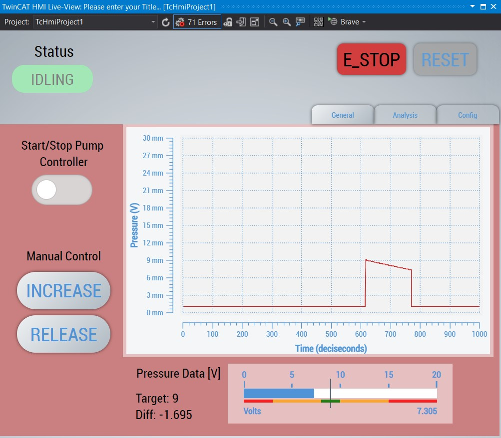
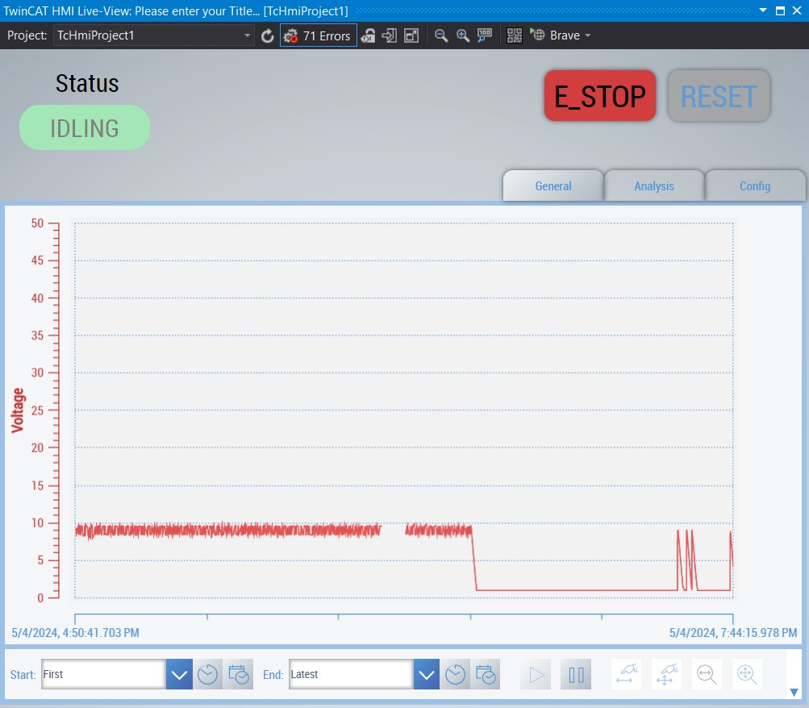

Video of the HMI in action: https://drive.google.com/file/d/1Lbk3OYMxQW990w1GKanXsBM9RZjLE0gA/view?usp=sharing
## Overview
- Basic UI
    - The colored status textbox on the top left indicates the state of the main loop. It can be in eight possible: IDLING, PUMPING, M_PUMPING (manual pumping), M_RELEASING (manual releasing), E_STOPPED, LEAK!, SMT_BROKE (something broke in hardware), and CtrlErr! (error in PID Controller). The textbox should turn red if the program enters E_STOPPED, LEAK, or SMT_BROKE. Otherwise, the textbox should be green, indicating that things are nominal. 
    - If the user clicks on the E_STOP button on the top right, both the pump controllers and the pumps themselves will be forced off. The only way to re-enable the pumps is to click the reset button on its right. Once the reset button is clicked and the user verifies that things are nominal again, the program will return to idle and wait for the user to start the pump controller again.
    - A leak, E-STOP, broken pump, or controller error status would shut down the pumps and their controllers.
- General Page
    - The general page has all of the essential buttons and information that users will need for the majority of the time. 
    - The Start/Stop toggle switch will turn the controller on and off. This is here in case the user needs to disable the controller for maintenance or wants to manually control the pump and valve using the INCREASE and RELEASE buttons.
    - In the middle of the page is a graph showing how the pressure has changed over the last 100 seconds. 
    - At the bottom of the page is a linear gauge showing the real-time pressure and target pressure. The target pressure is a black tick mark with green, yellow, and red colors underneath the gauge to show how close the current pressure is relative to the target pressure. The tick mark and colors move relative to the target pressure. 
- Analysis Page
    - Uses a historized symbol of nPressure to keep track of the pressure over the past 10,000 seconds. This can be extended for real-world implementation. 
    - Pausing the trend graph will let you see the individual data points, and clicking the data points will tell you the pressure value and time it was captured (to the milliseconds).
- Config Page
    - The config page is not implemented for the sake of time, but it would have contained the UI to dynamically change the pump controller the user wanted to use and set the PID's constants.

On a high level, the main program is a state machine that can be in RESET, ERROR, or NOMINAL states. When in RESET, the pumps and controllers are reset. When in error states like SMT_BROKE, E_STOPPED, or LEAK!, the pumps and the controllers are turned off until the machine goes into a reset state. When in nominal states like IDLING, PUMPING, RELEASING, M_RELEASE (manual release), or M_PUMPING (manual pumping), the program responds to the HMI and pump controllers.

As I am new to using TwinCAT, I wasn't sure how to simulate I/O and devices. Still, I ended up setting up creating a simple function block called FB_SimulatedIO, which increases the global variable "nPressure" by 0.01 if "bPump" is true and decreases it by 0.001 if it's false. The numbers are likely exaggerated from what would occur in real life, but this was done to test for edge cases more frequently. To use the code on real hardware, you have to set bRelayOn and nCurrentPressure to comment out the call to FB_SimulatedIO and FB_Pump in main.

For this assignment, I'm looking for a leak by seeing if the current pressure has decreased by a certain hysteresis value while the pump is on. While not the most effective approach, with some fine-tuning of the hysteresis, I believe that this could be a valid software approach for a leak detection program. To check whether the pump is broken, I check whether the pump has increased less than a certain threshold over 5 consecutive cycles of the pump being on. If this is the case, then the pump can be deemed too inefficient or slow for the needs of Machina. 

I have also implemented two types of controllers for the pump: a simple controller and a PID controller. The simple controller tries to make the current pressure close to the target pressure within a hysteresis. Although I could have made the controller try to match the target pressure, this isn't a good implementation in robotics because it will quickly wear out the pumps. 

When the pump is on, it checks for a leak by seeing if the pressure has increased by at least some threshold within a few cycles. If it hasn't, then there's likely a leak. The pump leak could either have been because the pump itself is broken or there are small leaks in valves or pipes. This is differentiated by whether the pressure difference was caused suddenly or if the pressure difference was gradual. If the pressure difference was gradual, then it's likely there was a leak, while if it was sudden, then it's likely that something broke. From this information, the program will either output to the HMI that there is a leak or that something is broken.

For the additional part of the assignment, I created a function block called KukaRobot that sends either 16#00000000 or 16#00000001 to the output DWORD 0 connected to the Kuka Robot, depending on whether the program detected a leak. I'm assuming here that the first bit of io that the robot receives is dword[0], but if it isn't, then we can make the latter 16#10000000. From my understanding, linking the output variable from the PLC program to the device's Module 3 (default IO) output should be enough to make the robot understand that there has been a failure with the pump.

Finally, I added my own twist to the assignment to hopefully make up for submitting this late. When learning about TwinCAT, I learned that we can connect to the ADS server using other languages and devices. This seemed very useful since we can offload computationally expensive tasks to another system or have extra sensors that aren't connected to PLCs and have them asynchronously give data to the PLC. This would expand the capabilities of the PLC system without compromising the real-time nature of the system. To show off this functionality, I created a Python program within the folder pythonCode, which uses a camera to capture motion and turns on the ESTOP via the ADS when motion is detected. https://drive.google.com/file/d/1YOsaRAnidoecDInBiVs7Af3mxeRY2mu3/view?usp=sharing

## Challenges
The first difficulty I faced was simulating the I/O of the EtherCAT device in my TwinCat Project. I wanted to use the same I/O variables that were used in the device for my project for ease of integration to the actual hardware. But I couldn't find documentation online nor was I successful after an hour of trial and error. So, for simplicity, I created a function block that simulates the pressure sensor and pump.  

The largest challenge for this assignment was the limitation of using a Desktop Windows computer. Although I have access to multiple computers, most of them run Linux, and my daily driver has been a Macbook for the past year. I tried getting a virtual machine working on these computers, but it was very slow and hard to work with. Even when I borrowed a friend's Windows laptop, I couldn't get TwinCat running on the machine because it didn't have Hyper-V support since it was running Windows 11 Home Edition. Fortunately, I could get TwinCAT running natively on a Desktop computer, but this option didn't give me much time to work on the assignment because I'm on campus for most of the week.

I also faced difficulties trying to get the HMI to update correctly. For instance, I ensured the colors changed when an action happened. Although this sounds trivial, I spent a decent chunk of my time doing this because I believe that a good HMI should be one that a user can look at with a glance and understand how the overall system is operating. And simple colors like red and green are very efficient ways to communicate this. Regardless, trying to implement this turned out to be more difficult than I anticipated because there are many ways to set the background color of widgets, and I wanted to be as consistent in my implementation as possible. That's why I ended up using Themes and classNames for each of the primary colors, Javascript for reading and setting PLC variables to give me more flexibility, and structured language to change the colors of the widgets because the UI is intuitive and easy to use.

## What I would do Differently
With more time, I would have liked to refine the controller system and its HMI. For this assignment, more complex controllers like a PID system aren't practical because of the simplicity of the model in simulation. Still, in real-world applications, being able to dynamically tune the PID parameters could have made finding the correct constants significantly easier. Being able to do this and other things like dynamically changing the controllers was my original goal for the config page, but I figured that controllers weren't the focus of this assignment.

The last thing that I wanted to try out with the software was tuning the cycle time. Since this is a RT machine, I wanted to try optimizing the time complexity of the program and decrease the runtime for each task. Although I feel like the cycle time could depend on the other devices in the field bus, it would still be good to see how much headroom the program has between tasks.

In terms of how I would improve the hardware, I would use other sensors like current sensors or pressure sensors to help gauge how efficient and healthy the pump is. If the pump has worse efficiency compared to its peers or in the past, it might mean that it has hit an obstacle or has gotten too worn for its previous use case. I would also have liked to see a valve to release the pressure within the pump. This could make the robot faster and more responsive. In my code, the PIDController uses this to quickly change pressure.
